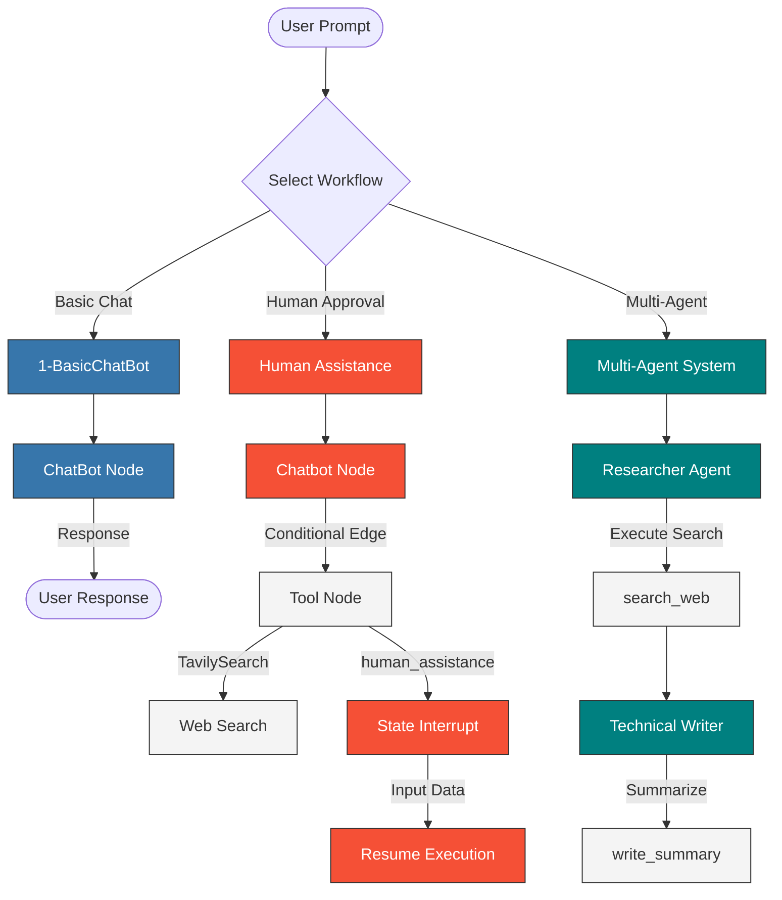
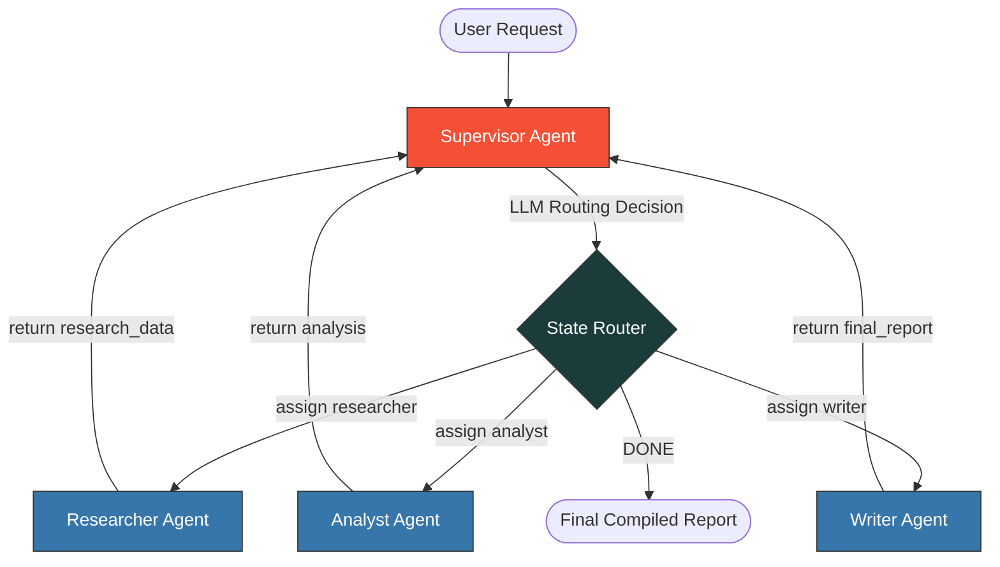

<div align="center">

# LangGraph Agentic AI Workspace

### Orchestrating Advanced Conversational, Human-in-the-Loop, and Multi-Agent Workflows

[](https://python.org)
[](https://langchain.com)
[](https://langchain-ai.github.io/langgraph/)
[](https://groq.com)
[](https://tavily.com)

An educational and production-ready workspace demonstrating agentic design patterns using LangGraph and LangChain. The project exhibits three core architectures: basic state-based conversational agents, human-in-the-loop orchestration with interrupts, and multi-agent coordination with specialized roles.

<br />

[](#how-it-works)
[](#getting-started)
[](#the-workflows)

</div>

---

## How It Works

This repository contains independent modules built on top of LangGraph's state machine execution model. Each module addresses a specific complexity pattern in AI agent design.

<details>
<summary><b>View System Orchestration & Flow Diagram</b></summary>



</details>

## Key Features

- **State-Based Graph Orchestration** — Flexible node-and-edge configuration utilizing LangGraph `StateGraph` with explicit state variables and message reducers (`add_messages`).
- **Human-in-the-Loop Interruption** — Mid-execution pauses utilizing LangGraph `interrupt` and `MemorySaver` checkpointer memory to request manual user inputs or reviews before resuming.
- **Supervised Multi-Agent Architecture** — Specialized agent routines (Researcher & Writer) cooperating dynamically via state passing and tool node routing.
- **High-Speed Inference** — Integrates `groq:llama-3.3-70b-versatile` via LangChain's unified `init_chat_model` for low-latency completions.
- **Dynamic Web Grounding** — Live internet queries using Tavily search APIs to provide real-time contexts.

## Tech Stack

<table>
  <thead>
    <tr>
      <th>Layer</th>
      <th>Technology</th>
      <th>Description</th>
    </tr>
  </thead>
  <tbody>
    <tr>
      <td><strong>State Orchestration</strong></td>
      <td>
        <a href="https://langchain-ai.github.io/langgraph/">
          
        </a>
      </td>
      <td>Builds execution graphs, custom node actions, state checkpointing, and conditional edges.</td>
    </tr>
    <tr>
      <td><strong>Agent Abstraction</strong></td>
      <td>
        <a href="https://langchain.com">
          
        </a>
      </td>
      <td>Core model bindings, tool validation decorators, system prompts wrappers, and chat initialization.</td>
    </tr>
    <tr>
      <td><strong>Inference Engine</strong></td>
      <td>
        <a href="https://groq.com">
          
        </a>
      </td>
      <td>Utilizes Groq Cloud APIs for Llama 3.3 execution.</td>
    </tr>
    <tr>
      <td><strong>Search Grounding</strong></td>
      <td>
        <a href="https://tavily.com">
          
        </a>
      </td>
      <td>Real-time search grounding integration for factual agent verification.</td>
    </tr>
    <tr>
      <td><strong>State Persistence</strong></td>
      <td>
        <a href="https://github.com/langchain-ai/langgraph">
          
        </a>
      </td>
      <td>In-memory checkpointer allowing manual interrupts, resumes, and state tracking.</td>
    </tr>
  </tbody>
</table>

## Project Structure

```
.
├── 1-BasiChatBot/
│   └── 1-basicchatbot.ipynb      # Basic StateGraph conversational agent
├── HumanAssitance/
│   └── HumaninLoop.ipynb         # Interrupt checkpointer and human-in-the-loop tool
├── MultiAgents/
│   └── Agents.ipynb              # Hierarchical multi-agent research & write graph
├── main.py                       # Global entrypoint script
├── pyproject.toml                # UV tool configuration & dependency specifications
├── requirements.txt              # Standard requirements file
├── .env                          # API secrets (GROQ & TAVILY)
└── README.md                     # System documentation
```

## Getting Started

### Prerequisites

- Python 3.13+
- A Groq API Key (get one from [console.groq.com](https://console.groq.com))
- A Tavily API Key (get one from [tavily.com](https://tavily.com))

### Installation

```bash
# Clone the repository
git clone https://github.com/your-username/langgraph-agentic-ai.git
cd langgraph-agentic-ai

# Create and activate a virtual environment
python -m venv .venv
source .venv/bin/activate  # On Windows: .venv\Scripts\activate

# Install dependencies using uv (recommended)
uv pip install -r requirements.txt
# Or using standard pip:
pip install -r requirements.txt
```

### Configuration

Create a `.env` file in the root of the project to configure your credentials:

```env
GROQ_API_KEY=your_groq_api_key_here
TAVILY_API_KEY=your_tavily_api_key_here
```

---

## The Workflows

### 1. Basic ChatBot
Located in [1-basicchatbot.ipynb](file:///Users/chokkaraketankumar/Desktop/Agentic%20Ai%20/Langraph-agentic-ai/1-BasiChatBot/1-basicchatbot.ipynb), this workflow configures a single-node graph mapping user prompts directly to the Groq inference engine. It demonstrates the fundamental mechanics of message serialization, graph node compilation, and invocation streaming.

### 2. Human-in-the-Loop Interruption
Located in [HumaninLoop.ipynb](file:///Users/chokkaraketankumar/Desktop/Agentic%20Ai%20/Langraph-agentic-ai/HumanAssitance/HumaninLoop.ipynb), this workflow uses a memory checkpointer (`MemorySaver`). When the chatbot attempts to trigger the `human_assistance` tool, the system invokes an `interrupt`, stopping execution and persisting the state. The user can inspect the state, edit the payload, and resume the graph run dynamically.

### 3. Multi-Agent System & Supervisor Architecture

Located in [Agents.ipynb](file:///Users/chokkaraketankumar/Desktop/Agentic%20Ai%20/Langraph-agentic-ai/MultiAgents/Agents.ipynb), this module explores advanced multi-agent orchestrations. It transitions from a basic linear handoff to an intelligent **Supervisor-led corporate team structure** managed dynamically by the LLM.

---

#### 🌟 Dual-Orchestration Designs

##### A. Sequential Handoff Flow (Linear ReAct)
A straight-line state transition where the **Researcher** performs the initial grounding and automatically passes control to the **Technical Writer** to output a finalized markdown summary.


##### B. Hierarchical Supervisor Pattern (Stateful Routing)
An advanced state machine where a centralized **Supervisor Agent** controls a group of specialized agents. The Supervisor reads the current conversation state and dynamically determines who works next, routing control iteratively until the task is complete.



> [!NOTE]
> **SupervisorState Definition**
> The state of the supervisor model is tracked using custom schema definitions:
> ```python
> class SupervisorState(MessagesState):
>     next_agent: str      # Tracks routing targets (researcher/analyst/writer/end)
>     research_data: str   # Gathers facts and search summaries
>     analysis: str        # Houses analytic insights and strategic risks
>     final_report: str    # Gathers the final report markdown compiled by the writer
>     task_complete: bool  # Signal flag to trigger END
>     current_task: str    # Stores original user request metadata
> ```

---

#### 🛠️ Team Member Profiles & Prompts

<details>
<summary><b>View Agent System Prompts & Configurations</b></summary>

1. **Supervisor Agent**
   - **Role**: Dynamic Project Manager.
   - **Instruction**: Evaluates variables `{has_research}`, `{has_analysis}`, and `{has_report}`. Invokes `groq:llama-3.3-70b-versatile` to decide the next step. Outputs only `researcher`, `analyst`, `writer`, or `DONE`.
2. **Researcher Agent**
   - **Role**: Gathers source information, details, background facts, and current trends.
3. **Analyst Agent**
   - **Role**: Reviews raw research data to provide actionable key insights, strategic risks, opportunities, and structured recommendations.
4. **Writer Agent**
   - **Role**: Synthesizes the analysis and research findings into a publication-grade Executive Report.

</details>

> [!TIP]
> **Dynamic Routing Logic**
> The supervisor routes messages using a declarative LangGraph conditional edge mapping function:
> ```python
> def router(state: SupervisorState) -> Literal["supervisor", "researcher", "analyst", "writer", "__end__"]:
>     next_agent = state.get("next_agent", "supervisor")
>     if next_agent == "end" or state.get("task_complete", False):
>         return END
>     return next_agent
> ```

---

## Customization

The workspace is designed to be highly modular and extensible. You can adapt it to any set of services:

| Component | Target File | Modification Details |
|:---|:---|:---|
| **Change LLM Model** | [pyproject.toml](file:///Users/chokkaraketankumar/Desktop/Agentic%20Ai%20/Langraph-agentic-ai/pyproject.toml) / Jupyter Notebooks | Modify `init_chat_model("groq:llama-3.3-70b-versatile")` parameters in notebooks. |
| **Alter Agent Roles** | [Agents.ipynb](file:///Users/chokkaraketankumar/Desktop/Agentic%20Ai%20/Langraph-agentic-ai/MultiAgents/Agents.ipynb) | Edit `system_msg` strings in the `researcher_agent` or `writer_agent` blocks. |
| **Add Custom Tools** | Jupyter Notebooks | Decorate new Python functions with `@tool` and bind them to the model (e.g., `llm.bind_tools(...)`). |
| **Add Checkpointers** | [HumaninLoop.ipynb](file:///Users/chokkaraketankumar/Desktop/Agentic%20Ai%20/Langraph-agentic-ai/HumanAssitance/HumaninLoop.ipynb) | Replace `MemorySaver` with persistent databases (e.g., `SqliteSaver` or `PostgresSaver`) for production. |

---

## Acknowledgments

- [LangGraph Documentation](https://langchain-ai.github.io/langgraph/) for state graph architecture and patterns.
- [LangChain Community](https://github.com/langchain-ai/langchain) for standard integrations.
- [Groq](https://groq.com) for high-performance Llama 3.3 model inference.

---
